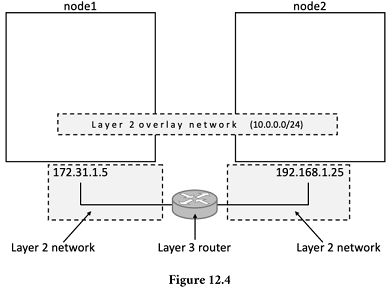
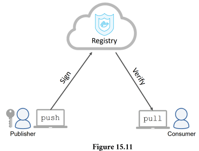

# Concepts

## The Docker technology

There are at least three things to be aware of when referring to Docker as a
technology:

1. The runtime
2. The daemon (a.k.a. engine)
3. The orchestrator


The runtime operates at the lowest level and is responsible for starting and
stopping containers (this includes building all of the OS constructs such as
`namespaces` and `cgroups`).
Docker implements a tiered runtime architecture with high-level and low-level
runtimes that work together.

The low-level runtime is called `runc` and is the reference implementation of
Open Containers Initiative (OCI) runtime-spec.
Its job is to interface with the underlying OS and start and stop containers.
Every container on a Docker node was created and started by an instance of runc.

The higher-level runtime is called `containerd`.
This manages the entire container lifecycle including pulling images and
managing `runc` instances.
`containerd` is pronounced “container-dee’ and is a graduated CNCF project used
by Docker and Kubernetes.

A typical Docker installation has a single long-running containerd process
instructing runc to start and stop containers.
runc is never a long-running process and exits as soon as a container is
started.

The Docker daemon (`dockerd`) sits above containerd and performs higher-level
tasks such as exposing the Docker API, managing images, managing volumes,
managing networks, and more…

# The Open Container Initiative (OCI)

The OCI is a governance council responsible for standardizing the low-level
fundamental components of container infrastructure.
In particular it focusses on *image format* and *container runtime*.

The TLDR of this *history according to Nigel* is that a company called CoreOS
(acquired by Red Hat which was then acquired by IBM) didn’t like the way Docker
did certain things.

So, they created an open standard called **appc** that defined things like image
format and container runtime.
They also created an implementation of the spec called **rkt** (pronounced
“rocket”).

This put the container ecosystem in an awkward position with two competing
standards.

With this in mind, everybody did their best to act like adults and came together
to form the OCI — a lightweight agile council to govern container standards.

The OCI has published two specifications (standards) -

- The image-spec
- The runtime-spec
- The distribution-spec

An analogy that’s often used when referring to these two standards is
*rail tracks*.
These two standards are like agreeing on standard sizes and properties of rail
tracks, leaving everyone else free to build better trains, better carriages,
better signalling systems, better stations… all safe in the knowledge that
they’ll work on the standardized tracks.

## The Ops Perspective

When you install Docker, you get two major components:

- The Docker client
- The Docker engine (sometimes called the “Docker daemon”)

The engine implements the runtime, API and everything else required to run
containers.

In a default Linux installation, the client talks to the daemon via a local
IPC/Unix socket at /var/run/docker.sock.
On Windows this happens via a named pipe at npipe:////./pipe/docker_engine.

## Docker Engine

The *Docker engine* is the core software that runs and manages containers.
We often refer to it simply as *Docker*.
If you know a thing or two about VMware, it might be useful to think of the
Docker engine as being like ESXi.

The Docker engine is modular in design and built from lots of small specialised
components.
Most of these are pulled from the Moby project (https://mobyproject.org/) and
implement open standards such as those maintained by the Open Container
Initiative (OCI).

In many ways, the Docker Engine is like a car engine — both are modular and
created by connecting many small specialized parts:

- A car engine is made from many specialized parts that work together to make a
   car drive — intake manifolds, throttle body, cylinders, pistons, spark plugs,
   exhaust manifolds etc.
- The Docker Engine is made from many specialized tools that work together to
   create and run containers — The API, image builder, high-level runtime,
   low-level runtime, shims etc.

At the time of writing, the major components that make up the Docker engine are
the Docker daemon, the build system, containerd, runc, and various plugins such
as networking and volumes.
Together, these create and run containers.


When Docker was first released, the Docker engine had two major components:

- The Docker daemon (sometimes referred to as just “the daemon”)
- LXC

The Docker daemon was a monolithic binary – it contained all the code for API,
the runtime, image builds, and more.

LXC provided the daemon with access to the fundamental building-blocks of
containers that existed in the Linux kernel.
Things like *namespaces* and *control groups (cgroups)*.


## Getting rid of LXC

The reliance on LXC was an issue from the start.

First up, LXC is Linux-specific.
This was a problem for a project that had aspirations of being multi-platform.

Second up, being reliant on an external tool for something so core to the
project was a huge risk.

As a result, Docker. Inc. developed their own tool called *libcontainer* as a
replacement for LXC.
The goal of *libcontainer* was to be a platform-agnostic tool that provided
Docker with access to the fundamental container building-blocks that exist in
the host kernel.

Libcontainer replaced LXC as the default *execution driver* a very long time ago
in Docker 0.9.

## Getting rid of the monolithic Docker daemon

Over time, the monolithic nature of the Docker daemon became more and more
problematic:

1. It’s hard to innovate on
2. It got slower
3. It wasn’t what the ecosystem wanted

Docker, Inc. was aware of these challenges and began a huge effort to break
apart the monolithic daemon and modularize it.
The aim of this work was to break out as much of the functionality as possible
from the daemon and re-implement it in smaller specialized tools.
These specialized tools can be swapped out, as well as easily re-used by third
parties to build other tools.
This plan followed the tried-and-tested Unix philosophy of building small
specialized tools that can be pieced together into larger tools.

This work of breaking apart and re-factoring the Docker engine has seen **all**
**of the container execution and container runtime code entirely removed from**
**the daemon and refactored into small, specialized tools**.


## The influence of the Open Container Initiative (OCI)

While Docker, Inc. was breaking the daemon apart and refactoring code, the OCI
was in the process of defining container-related standards:

1. [Image spec](https://github.com/opencontainers/image-spec)
2. [Container runtime spec](https://github.com/opencontainers/runtime-spec)

All Docker versions since 2016 implement the OCI specifications.
For example, the Docker daemon no longer contains any container runtime code —
all container runtime code is implemented in a separate OCI-compliant layer.
By default, Docker uses `runc` for this. runc is the *reference* implementation
of the OCI container-runtime-spec.
This is the `runc` container runtime layer in Figure 5.3.

As well as this, the `containerd` component of the Docker Engine makes sure
Docker images are presented to `runc` as valid OCI bundles.

## runc

As previously mentioned, `runc` is the OCI container-runtime-spec reference
implementation.
Docker, Inc. was heavily involved in defining the spec and developing runc.

If you strip everything else away, runc is a small, lightweight CLI wrapper for
libcontainer – remember that libcontainer originally replaced LXC as the
interface layer with the host OS in the early Docker architecture.

runc has a single purpose in life — create containers.
And it’s fast.
But as it’s a CLI wrapper, it’s effectively a standalone container runtime tool.
This means you can download and build the binary, and you’ll have everything you
need to build and play with runc (OCI) containers.
But it’s bare bones and very low-level, meaning you’ll have none of the richness
that you get with the full Docker engine.

We sometimes say that runc operates at “the OCI layer”. See Figure 5.3.

## containerd

As part of the effort to strip functionality out of the Docker daemon, all of
the container execution logic was ripped out and refactored into a new tool
called containerd (pronounced container-dee).
Its sole purpose in life is to manage container lifecycle operations such as
`start | stop | pause | rm`....

`containerd` is available as a daemon for Linux and Windows, and Docker has been
using it on Linux since the 1.11 release.
In the Docker engine stack, containerd sits between the daemon and runc at the
OCI layer.

As previously stated, containerd was originally intended to be small,
lightweight, and designed for a single task in life — container lifecycle
operations.
However, over time it has branched out and taken on more functionality.
Things like image pulls, volumes and networks.

One of the reasons for adding more functionality is to make it easier to use in
other projects.
For example, in Kubernetes it’s beneficial for containerd to do things like push
and pull images.
However, all the extra functionality is modular and optional, meaning you can
pick and choose which bits you want.
So, it’s possible to include containerd in projects such as Kubernetes, but only
to take the pieces your project needs.

containerd was originally developed by Docker, Inc. and donated to the Cloud
Native Computing Foundation (CNCF).
At the time of writing, containerd is a fully graduated CNCF project, meaning
it’s stable and considered ready for production.

## Starting a new container

Once the daemon receives the command to create a new container, it makes a call
to containerd. Remember that the daemon no-longer contains any code to create
containers!

The daemon communicates with containerd via a CRUD-style API over gRPC.

Despite its name, *containerd* cannot actually create containers.
It uses *runc* to do that.
It converts the required Docker image into an OCI bundle and tells runc to use
this to create a new container.

runc interfaces with the OS kernel to pull together all of the constructs
necessary to create a container (namespaces, cgroups etc.).
The container process is started as a child-process of runc, and as soon as it
starts, runc will exit.


Having all of the logic and code to start and manage containers removed from the
daemon means that the entire container runtime is decoupled from the Docker
daemon.
We sometimes call this “daemonless containers” and it makes it possible to
perform maintenance and upgrades on the Docker daemon without impacting running
containers.

## shim

The shim is integral to the implementation of daemonless containers — what we
just mentioned about decoupling running containers from the daemon for things
like daemon upgrades.

We mentioned earlier that *containerd* uses `runc` to create new containers.
In fact, it forks a new instance of runc for every container it creates.
However, once each container is created, the runc process exits.
This means we can run hundreds of containers without having to run hundreds of
runc instances.

Once a container’s parent runc process exits, the associated containerd-shim
process becomes the container’s parent.
Some of the responsibilities the shim performs as a container’s parent include:

- Keeping any STDIN and STDOUT streams open so that when the daemon is
restarted, the container doesn’t terminate due to pipes being closed etc.

- Reports the container’s exit status back to the daemon.

## Linux implementation

On a Linux system, the components we’ve discussed are implemented as separate
binaries as follows:

- `/usr/bin/dockerd` (the Docker daemon)
- `/usr/bin/containerd`
- `/usr/bin/containerd-shim-runc-v2`
- `/usr/bin/runc`

## Distribution Hash

Hash of compressed images for push/pull operations verification.

## Manifest

A single image tag supports multiple platforms and architectures.


## Restart Policy

- **always:** container also restarts when daemon restarts
- **unless-stopped:** container won't restart when daemon restarts
- **on-failure:** container restarts only on non-zero exit code & when daemon restarts

```sh
docker container stop # temporarily stops any container
```

## Docker Swarm Ports

- **2377/tcp:** for secure client-to-swarm communication (management plane)
- **7946/tcp and udp:** for control plane gossip (SWIM-based gossip)
- **4789/udp:** for VXLAN-based overlay networks (data plane)

## Imperative Vs Declarative

| Imperative | Declarative |
| :-: | :-: |
| docker container run | docker compose up |
| docker service create | docker stack deploy |

## Port Publishing Modes

- **Ingress:** Publish ports even on nodes not running any service replica.
- **Host:** Only publish on nodes running replicas.

## Logging Drivers

`docker service logs` can be used to view Swarm Service logs.
But not all logging drivers support it.
By default, Docker nodes configure services to use the *json-file* log driver.

Some other log drivers:

- awslogs
- gelf
- gcplogs
- journald (only works on Linux hosts running *systemd*)
- splunk
- syslog

*json-file* and *journald* are the easiest to configure.

For custom settings, create a *daemon.json* file at */etc/docker/daemon.json*.

```json
{
  "log-driver": "syslog"
}
```

To force individual services to use a different driver, pass `--log-driver` and
`--log-opts` flags to `docker service create` command.
This overrides *daemon.json*.

Service logs expect applications to run as PID 1, and send logs to STDOUT, and
errors to STDERR.
The logging driver forwards these "logs" to the locations configured via the
loggin driver.

## Backup & Recover Swarm

Backing up a swarm means to backup the control plane.

A Scenario.
The control plane is replicated and highly-available (HA).
Then why do we need it?
Let's suppose that a malicious actor deletes all of the Secrets on a swarm.
HA can't help, because this operation is automatically replicated to all the
manager nodes.
Now, you only recovery options are to either recreate the deleted objects from
copies in a vault or source code repo, or attempt a recovery from a recent
backup.

Swarm configuration and state is stored in */var/lib/docker/swarm* on every
manager node.
A *swarm backup* is a copy of all the files in this directory.

You can perform backup from any manager node.
But you *should* perform it from a non-leader manager, because docker must be
stopped before creating a backup.
Because if you initiate backup on the leader node, then this will trigger a
leader re-election.

## Docker Network

Docker networking is based on an open-source pluggable architecture called the
*Container Network Model (CNM)*.
`libnetwork` is the reference implementation of the CNM, and it provides all of
Docker's core networking capabilities.
Drivers plug-in to `libnetwork` to provide specific network topologies.

Docker networking comprises of 3 major components:

- **The Container Network Model (CNM):** The design specification.
- **Libnetwork:** real-world implementation of the CNM. It's open-sourced as a
   part of the Moby project.
- **Drivers:** extends the model by implementing specific network topologies
   such as VXLAN overlay networks.


## The Container Network Model (CNM)

It defines 3 building blocks:

- **Sandbox:** an isolated network stack in a container. It includes Ethernet
   interfaces, ports, routing tables, and DNS config.
- **Endpoints:** are virtual network interfaces (e.g. veth). Like normal network
   interfaces, these are responsible for making connections. For example,
   *endpoints* to connect *sandboxes* to *networks*.
- **Networks:** are software implementation of a switch (802.1d bridge).
   As such, they group together and isolate a collection of endpoints that need to
   communicate.

The atomic unit of scheduling on Docker is the container.
*Sandboxes* are placed inside of containers to provide network connectivity.


Container A and Container B can communicate because they are both connected to
Network A.
However, the two endpoints in Container B cannot communicate with each other
without the assistance of a layer 3 router.

*endpoints* behave like regular network adapters, meaning they can only be
connected to a single network.
Therefore, a container needing to connect to multiple networks will need
multiple endpoints.


Although Container A and Container B are running on the same host, their
network stacks are completely isolated at the OS-level via the sandboxes and can
only communicate via a network.

## Libnetwork & Drivers

Apart from implementing the core components of the CNM, `libnetwork` also
implements native *service discovery*, *ingress-based container load balancing*,
and the network control plane and management plane.

*Drivers* implement the data plane.
For example, connectivity and isolation is all handled by drivers.
So is the creation of networks.


Docker comes with several built-in drivers, known as native drivers or
*local drivers*.
These include *bridge*, *overlay*, and *macvlan*, and they build the most
common network topologies.
3rd-parties can also write network drivers to implement other network topologies
and more advanced configurations.

Every network is owned by a driver, and the driver is responsible for the
creation and management of all resources on the network.
For example, an overlay network called "prod-fe-cuda" will be owned and managed
by the *overlay* driver.
This means the *overlay* driver is invoked for the creation, management, and
deletion of all resources on that network.

`libnetwork` allows multiple network drivers to be active at the same time.

## Single-host bridge networks

- **Single-host** tells us it only spans a single Docker host and can only
   connect containers that are on the same host.
- **Bridge** tells us that it's an implementation of an 802.1d bridge
   (layer 2 switch).

Docker on Linux creates single-host bridge networks with the built-in *bridge*
driver, whereas Docker on Windows creates them using the built-in *nat* driver.
For all intents and purposes, they work the same.


Docker network built with the *bridge* driver on Linux hosts are based on the
battle-hardened *linux bridge* technology that has existed in the Linux kernel
for 20 years.
This means they're high performance and extremely stable.
It also means you can inspect them using standard Linux utilities.
For example.

```sh
ip link show docker0

```

The default “bridge” network, on all Linux-based Docker hosts, maps to an
underlying Linux *bridge* in the kernel called “**docker0**”.
We can see this from the output of *docker* inspect.

```sh
docker inspect bridge | grep bridge.name

```


The "bridge" network maps to the "docker0" Linux bridge in the host's kernel,
which maps to an Ethernet interface on the host via port mappings.

## Docker DNS Ping

```sh
# Containers in the same network can ping each other by name.
# Doesn't work on the default bridge network.
# Works for user-defined bridge network though.
docker network create -d bridge localnet
# A new Linux bridge will be the kernel.
```

You can use the `brctl` tool to look at Linux bridges.
`apt install bridge-utils`

`$ brctl show`
| bridge name | bridge id | STP enabled | interfaces |
| :-: | :-: | :-: | :-: |
| docker0 | 8000.0242aff9eb4f | no ||
| br-20c2e8ae4bbb | 8000.02429636237c | no ||

The output shows two bridges.
The first line is the "docker0" bridge that we already know about.
The second bridge (br-20c2e8ae4bbb) relates to the new `localnet` bridge network
just created.
Neither have any devices connected (*interfaces* column).

```sh
# Create c1
docker run -d --name c1 --network localnet alpine sleep 1d
```

`$ brctl show`
| bridge name | bridge id | STP enabled | interfaces |
| :-: | :-: | :-: | :-: |
| br-20c2e8ae4bbb | 8000.02429636237c | no | vethe792ac0 |
| docker0 | 8000.0242aff9eb4f | no ||

```sh
# Create c2
docker run -it --name c2 --network localnet alpine sh
# Ping c1 by name successfully.
ping c1
```

This works because the c2 container is running a local DNS resolver that
forwards requests to the internal Docker DNS server.
This DNS server maintains mappings for all containers started with the `--name`
or `--net-alias` flag.

## Port Mappings

So far, containers on bridge networks can only communicate with other containers
on the same network.
However, you can get around this using *port mappings*.

Port mappings let you map a container to a port on the Docker host.
Any traffic hitting the Docker host on the configured port will be re-directed
to the container.


```sh
# Run NGINX
docker container run -d --name web --network localnet --publish 5001:80 nginx

# Verify port mapping
docker port web
# This shows the port mapping exists on all interfaces on the Docker host.
```

Mapping ports like this works, but it's clunky and doesn't scale.
For example, only one container can bind to any particular port on the host.
In our example, no other containers will be able to bind to port 5001.
This is one of the reasons that single-host bridge networks are only useful
for local development and very small applications.

## Multi-host overlay networks

Overlay networks are multi-host.
This means a single network can span every node in a swarm, allowing containers
on different hosts to communicate.
They're great for container-to-container communication and they scale well.

Docker provides a native driver for overlay networks.
This makes creating them as simple as adding the `-d overlay` flag to the
`docker network create` command.

## Connecting to existing networks

The ability to connect containerized apps to external systems and physical
networks is important.
A common example is partially containerized apps — the containerized parts
need a way to communicate with the parts still running on existing physical
networks and VLANs.

The built-in `MACVLAN` driver (`transparent` on Windows) was created with this
in mind.
It gives each container its own IP and MAC address on the external physical
network, making them look just like a physical server or VM.


On the positive side, MACVLAN performance is good as it doesn’t require port
mappings or additional bridges.
However, it requires the host NIC to be in **promiscuous mode**, which isn’t
allowed on many corporate networks and public cloud platforms.
So… MACVLAN is great for your data center networks **if** your network team
allows *promiscuous mode*, but it probably won’t work on your public cloud.

## MACVLAN Example

This example will work if your host NIC is in promiscuous mode on a network that
allows it.
It also requires an existing VLAN 100 on the network.
You can adapt it if the VLAN config on your physical network is different.

Assume we have an existing physical network with two VLANS:

- VLAN 100: 10.0.0.0/24
- VLAN 200: 192.168.3.0/24


Then comes a requirement for a container running on that host to be on VLAN 100.
To do this, we create a new Docker network with the `macvlan` driver.
However, the `macvlan` driver needs us to tell it a few things about the network
we’re plumbing it into.

Things like:

- Subnet info
- Gateway
- Range of IPs it can assign to containers
- Which interface or sub-interface on the host to use

Create a new MACVLAN network called "macvlan100" that will connect containers
to VLAN 100.
You may have to change the parent interface name from *eth0* to match the parent
interface name on your system, such as *enp0s1*.
For example, changing `-o parent=eth0.100` to `-o parent=enp0s1.100`.

```sh
docker network create -d macvlan \
  --subnet=10.0.0.0/24 \
  --ip-range=10.0.0.0/25 \
  --gateway=10.0.0.1 \
  -o parent=eth0.100 \
  macvlan100

```

This will create the “macvlan100” network and the eth0.100 sub-interface.


MACVLAN uses standard Linux *sub-interfaces*, and you tag them with the ID of
the VLAN they will connect to.
In this example, we’re connecting to VLAN 100, so we tag the sub-interface with
*.100 (-o parent=eth0.100)*.

We also used the *--ip-range* flag to tell the MACVLAN network which sub-set of
IP addresses it can assign to containers.
It’s vital that this range of addresses is reserved for Docker and not in use by
other nodes or DHCP servers as the MACVLAN driver has no management plane
feature to check for overlapping IP ranges.

```sh
# Deploy container on macvlan100 network.
docker run -d --name mactainer1 --network macvlan100 alpine sleep 1d
```


Remember, the underlying network (VLAN 100) does not see any of the MACVLAN
magic, it only sees the container with its MAC and IP addresses.
This means the “mactainer1” container will be able to ping and communicate with
any other systems on VLAN 100.

**Note:** If you can’t get this to work, it might be because the host NIC is not
in promiscuous mode.
Remember that public cloud platforms don’t usually allow promiscuous mode.

At this point, we’ve got a MACVLAN network and used it to connect a new
container to an existing VLAN.
However, it doesn’t stop there.
The Docker MACVLAN driver is built on top of the tried-and-tested Linux kernel
driver with the same name.
As such, it supports VLAN trunking.
This means we can create multiple MACVLAN networks and connect containers on the
same Docker host to them as shown in Figure 11.17.


## Container and Service logs for troubleshooting

On Windows systems, daemon logs are stored under `∼AppData\Local\Docker` and
you can view them in the Windows Event Viewer.

On Linux, it depends which `init` system you’re using.
If you’re running a `systemd`, logs will go to `journald` and you can view them
with the `journalctl -u docker.service` command.

If you’re not running `systemd` you should look under the following locations:

- Ubuntu systems running `upstart`: `/var/log/upstart/docker.log`
- RHEL-based systems: `/var/log/messages`
- Debian: `/var/log/daemon.log`

You can also tell Docker how verbose you want daemon logging to be.
To do this, edit the daemon config file (`/etc/docker/daemon.json`) so that
“`debug`” is set to “`true`” and “`log-level`” is set to one of the following:

- `debug` The most verbose option
- `info` The default value and second-most verbose option
- `warn` Third most verbose option
- `error` Fourth most verbose option
- `fatal` Least verbose option

The following snippet from a `daemon.json` enables debugging and sets the level
to `debug`.
It will work on all Docker platforms.

```sh
{
  <Snip>
  "debug":true,
  "log-level":"debug",
  <Snip>
}

```

If the daemon.json file doesn’t exist, create it!
Also, be sure to restart Docker after making changes to the file.

This was about daemon logs.

If logs doesn't show anything, try this.

- `docker service ps --no-trunc {serviceName}`
- `journalctl -u docker.service | tail -n 50`

It depends on your OS.
Here are the few locations, with commands for few Operating Systems:

- Ubuntu (old using upstart ) - `/var/log/upstart/docker.log`
- Ubuntu (new using systemd ) - `journalctl -u docker.service`
- Boot2Docker - `/var/log/docker.log`
- Debian GNU/Linux - `/var/log/daemon.log`
- CentOS - `/var/log/daemon.log | grep docker`
- CoreOS - `journalctl -u docker.service`
- Fedora - `journalctl -u docker.service`
- Red Hat Enterprise Linux Server - `/var/log/messages | grep docker`
- OpenSuSE - `journalctl -u docker.service`
- OSX - `~/Library/Containers/com.docker.docker/Data/com.docker.driver.amd64-linux/log/d‌​ocker.log`
- Windows - `Get-EventLog -LogName Application -Source Docker -After (Get-Date).AddMinutes(-5) | Sort-Object Time`

## Service discovery

Apart from core networking, `libnetwork` also provides important network
services.

*Service discovery* allows all containers and Swarm services to locate each
other by name.
The only requirement is that they are on the same network.

Under the hood, this leverages Docker’s embedded DNS server and the DNS resolver
in each container.


Every Swarm service and standalone container started with the `--name` flag will
register its name and IP with the Docker DNS service.
This means all containers and service replicas can use the Docker DNS service to
find each other.
However, service discovery is *network-scoped*, meaning name resolution only
works for containers and Services on the same network.
If two containers are on different networks, they will not be able to resolve
each other.

One last point on service discovery and name resolution…

It’s possible to configure Swarm services and standalone containers with
customized DNS options.
For example, the `--dns` flag lets you specify a list of custom DNS servers to
use in case the embedded Docker DNS server cannot resolve a query.
This is common when querying names of services outside of Docker.
You can also use the `--dns-search` flag to add custom search domains for
queries against unqualified names (i.e., when the query isn’t a fully qualified
DNS name).

This works on Linux by adding entries to the `/etc/resolv.conf` of every
container.

The following example will start a new standalone container and add the infamous
*8.8.8.8* Google DNS server, as well as *nigelpoulton.com* as search domain for
unqualified queries.

```sh
docker container run -it --name c1 \
  --dns=8.8.8.8 \
  --dns-search=nigelpoulton.com \
  alpine sh

```

## Ingress load balancing

Swarm supports two network publishing modes that make services accessible
outside of the cluster:

- Ingress mode (default)
- Host mode

Services published via *ingress mode* can be accessed from any node in the Swarm
-- even nodes **not** running a service replica.
Services published via *host mode* can only be accessed by hitting nodes running
service replicas.


Ingress mode is the default.
This means any time you publish a service with `-p` or `--publish` it will
default to *ingress mode*.
To publish a service in *host mode* you need to use the long format of the
`--publish` flag **and** add `mode=host`.

```sh
docker service create -d --name svc1 \
  --publish published=5001,target=80,mode=host \
  nginx
# published=5001 makes the service available externally via port 5001.

# target=80 makes sure requests hitting the published port get mapped back to
# port 80 on the service replicas.

# mode=host makes sure requests will only reach the service if they arrive on
# nodes running a service replica.
```

Ingress mode is what you’ll normally use.

Behind the scenes, ingress mode uses a layer 4 routing mesh called the
**service mesh** or the **swarm-mode service mesh**.


If there are multiple replicas, traffic will be balanced across them all.


## Docker Networking - The Commands

Docker networking has its own docker network sub-command.
The main commands include:

- `docker network ls`: Lists all networks on the local Docker host.
- `docker network create`:
   Creates new Docker networks.
   By default, it creates them with the `nat` driver on Windows and the `bridge`
   driver on Linux.
   You can specify the driver (type of network) with the `-d` flag.
   `docker network create -d overlay overnet` will create a new overlay network
   called overnet with the native Docker `overlay` driver.
- `docker network inspect`:
   Provides detailed configuration information about a Docker network.
   Same as docker inspect.
- `docker network prune`: Deletes all unused networks on a Docker host.
- `docker network rm`: Deletes specific networks on a Docker host.

## Docker Overlay Networking

Overlay networks create a flat, secure, layer 2 networks spanning multiple
hosts.
Containers on different hosts can connect to the same overlay network and
communicate directly.
The default native overlay networking is built on top of `libnetwork` and the
native **overlay** driver.

Swarm mode is a pre-requisite for Docker overlay networks.

```sh
# Create node1 (manager)
docker swarm init \
  --advertise-addr=172.31.1.5 \
  --listen-addr=172.31.1.5:2377

# Create node2 (worker)
docker swarm join \
  --token ...
  172.31.1.5:2377

# Create an overlay network on node1
docker network create -d overlay uber-net
```

This overlay network is available to all hosts in the swarm and has its control
plane encrypted with TLS (AES in GCM mode with keys automatically rotated every
12 hours).
To encrypt the data plane, add `-o encrypted` flag to the command.
However, data plane encryption isn't enabled by default because of the
performance overhead.
Be sure to test performance before enabling data plane encryption in your
production environments.
However, if you do enable it, it’s protected by the same AES in GCM mode with
key rotation.

Control plane traffic is cluster management traffic.
Data plane traffic is application traffic.
By default, Docker overlay networks encrypt cluster management traffic but not
application traffic.
You must explicitly enable encryption of application traffic.

`docker network ls` in **node1** will show **uber-net**, but not on **node2**.

This is because new overlay networks are only extended to worker nodes when the
worker is tasked with running a container on the network.
This lazy approach to extending overlay networks improves scalability by
reducing the amount of network gossip.

```sh
# Create service with 2 replicas
docker service create --name test \
  --network uber-net \
  --replicas 2 \
  ubuntu sleep infinity

# Now uber-net will be visible on node2
docker network ls
```

Standalone containers that are not part of a *swarm service* cannot attach to
overlay networks unless the network was created with the `attachable=true`
property.

```sh
docker network create -d overlay --attachable uber-net
```


## Overlay networks explained

Docker overlay networking uses *VXLAN tunnels* to create virtual layer 2 overlay
networks.

## VXLAN

VXLANs let you create layer 2 network on top of an existing layer 3
infrastructure.



It's an encapsulation technology.
This means existing routers and network infrastructure just see it as regular
IP/UDP packets and handle without requiring any changes.

To create the overaly, a *VXLAN tunnel* is created through the underlay
networks.
The tunnel allows traffic to flow freely without having to interact with the
complexity of the underlay networks.
The *underlay networks* or *underlay infrastructure* are referred to as networks
the overaly has to tunnel through.

Each end of the VXLAN tunnel is terminated by a VXLAN Tunnel Endpoint (VTEP).
It's this VTEP that encapsulates and de-encapsulates the traffic entering and
exiting the tunnel.


## VXLAN Two-container example

A new *sandbox* (network namespace) was created on each host.

A virtual switch called **Br0** was created inside the sandboxes.
A VTEP is also created with one end plumbed into the **Br0** virtual switch and
the other end plumber into the host network stack.
The end in the host network stack gets an IP address on the underlay network the
host is connected to and is bound to a UDP socket on port 4789.
The two VTEPs on each host create the overlay via a VXLAN tunnel.


Each container then gets its own virtual Ethernet (`vnet`) adapter that is also
plumbed into the local **Br0** virtual switch.


## VXLAN Communication Example


**C1** creates the ping requests and sets the destination IP address to be the
10.0.0.4 address of **C2**.

**C1** doesn’t have an entry for **C2** in its local MAC address table (ARP
cache) so it floods the packet on all interfaces.
The VTEP interface is connected to **Br0** which knows how to forward the frame,
so responds with its own MAC address.
This is a proxy *ARP* reply and results in the VTEP *learning* how to forward
the packet and updating its MAC table so that all future packets for **C2** will
be transmitted directly to the local VTEP.
The **Br0** switch knew about **C2** because all newly started containers have
their network details propagated to other nodes in the swarm using the network’s
built-in gossip protocol.

The ping is sent to the VTEP interface which performs the encapsulation required
to tunnel it through the underlay networks.
At a fairly high level, this encapsulation adds a VXLAN header to individual
Ethernet frames.
This header contains the VXLAN network ID (VNID) which is used to map frames
from VLANs to VXLANs and vice-versa.
Each VLAN gets mapped to VNID so that packets can be de-encapsulated on the
receiving end and forwarded to the correct VLAN.
This maintains network isolation.

The encapsulation also wraps the frame in a UDP packet and adds the IP of the
remote VTEP on node2 in the *destination IP field*.
It also adds the UDP port 4789 socket information.
This encapsulation allows the packets to be sent across the underlay networks
without the underlays having to know anything about VXLAN.

When the packet arrives at node2, the kernel sees it’s addressed to UDP port
4789.
The kernel also knows it has a VTEP bound to this socket.
As a result, it sends the packet to the VTEP, which reads the VNID,
de-encapsulates the packet, and sends it on to its own local **Br0** switch on
the VLAN corresponding the VNID.
From there it is delivered to container **C2**.

One final thing.
Docker also supports Layer 3 routing within an overlay network.
For example, you can create an overlay network with two subnets and Docker will
take care of routing between them.

```sh
docker network create \
  --subnet=10.1.1.0/24 \
  --subnet=11.1.1.0/24 \
  -d overlay prod-net
```

This would result in two virtual switches, **Br0** and **Br1**, inside the
*sandbox* and routing happens automatically.

## Docker overlay networking - The commands

- `docker network create` is the command to create a new container network.
   The `-d` flag specifies the driver to use, and the most common driver is
   `overlay`.
   You can also install and use drivers from 3rd parties.
   For overlay networks, the control plane is encrypted by default.
   You can encrypt the data plane by adding the `-o encrypted` flag but performance
   overhead might be incurred.
- `docker network ls` lists all of the container networks visible to a Docker
   host.
   Docker hosts running in *swarm mode* only see overlay networks if they are
   running containers attached to those networks.
   This keeps network-related gossip to a minimum.
- `docker network inspect` shows detailed information about a particular
   container network.
   This includes *scope*, *driver*, *IPv4* and *IPv6* info, subnet configuration,
   *IP addresses of connected containers*, *VXLAN network ID*, and
   *encryption state*.
- `docker network rm` deletes a network.

## Volume and persistent data

There are two main categories of data — persistent and non-persistent.

To deal with non-persistent data, every Docker container gets its own
non-persistent storage.
This is automatically created for every container and is tightly coupled to the
lifecycle of the container.
As a result, deleting the container will delete the storage and any data on it.

To deal with persistent data, containers need to store it in a volume.
Volumes are separate objects that have their lifecycles decoupled from
containers.
This means you can create and manage volumes independently, and they don’t get
deleted when their container is deleted.

## Containers and non-persistent data

Containers created by Docker have a thin read-write layer on top of the
read-only images they’re based on.


Each writable container layer exists in the filesystem of the Docker host and
you’ll hear it called various names.
These include *local storage*, *ephemeral storage*, and *graphdriver storage*.

It’s typically located on the Docker host in these locations:

- Linux Docker hosts: `/var/lib/docker/<storage-driver>/`...
- Windows Docker hosts: `C:\ProgramData\Docker\windowsfilter\`...

This thin writable layer is an integral part of many containers and enables all
read/write operations.
If you, or an application, update files or add new files, they’ll be written
to this layer.
However, it’s tightly coupled to the container’s lifecycle — it gets created
when the container is created and it gets deleted when the container is deleted.

## Containers and persistent data

*Volumes* are the recommended way to persist data in containers.
There are three major reasons for this:

- Volumes are independent objects that are not tied to the lifecycle of a
   container.
- Volumes can be mapped to specialized external storage systems.
- Volumes enable multiple containers on different Docker hosts to access and
   share the same data.

At a high-level, you create a volume, then you create a container and mount the
volume into it.
The volume is mounted into a directory in the container’s filesystem, and
anything written to that directory is stored in the volume.
If you delete the container, the volume and its data will still exist.

Figure 13.2 shows a Docker volume existing outside of the container as a
separate object.
It is mounted into the container’s filesystem at `/data`, and any data written
to the `/data` directory will be stored on the volume and will exist after the
container is deleted.


In Figure 13.2, the `/data` directory is a Docker volume that can either be
mapped to an external storage system or a directory on the Docker host.
Either way, its lifecycle is decoupled from the container.
All other directories in the container use the thin writable container layer in
the local storage area on the Docker host.

## Creating and managing Docker volumes

Volumes are first-class objects in Docker.
Among other things, this means they are their own object in the API and have
their own `docker volume` sub-command.

```sh
docker volume create myvol
```

By default, Docker creates new volumes with the built-in `local` driver.
As the name suggests, volumes created with the `local` driver are only available
to containers on the same node as the volume.
You can use the `-d` flag to specify a different driver.

Third-party volume drivers are available as plugins.
These provide Docker with advanced features and seamless access external storage
systems such as cloud storage services and on-premises storage systems including
SAN and NAS.


All volumes created with the `local` driver get their own directory under
`/var/lib/docker/volumes` on Linux, and `C:\ProgramData\Docker\volumes` on
Windows.

## Sharing storage across cluster nodes


Building a setup like this requires a lot of things.
You need access to a specialised storage systems and knowledge of how it works
and presents storage.
You also need to know how your applications read and write data to the shared
storage.
Finally, you need a volume driver plugin that works with the external storage
system.

Volume drivers are available as plugins that run as containers, and the best
place to find them is Docker Hub.


## Volumes and persistent data - The Commands

- `docker volume create` is the command to create new volumes.
   By default, volumes are created with the `local` driver but you can use the `-d`
   flag to specify a different driver.
- `docker volume ls` will list all volumes on the local Docker host.
- `docker volume inspect` shows detailed volume information.
- `docker volume prune` will delete **all** volumes that are not in use by a
   container or service replica.
- `docker volume rm` deletes specific volumes that are not in use.
- `docker plugin install` installs new volume plugins from Docker Hub.
- `docker plugin ls` lists all plugins installed on a Docker host.

## Deploying apps with Docker Stacks

Docker Stacks let you define complex multi-service apps in a single declarative
file.
They also provide a simple way to deploy and manage entire application
lifecycles — initial deployment > health checks > scaling > updates > rollbacks
and more.

The process is simple.
Define what you want in a *Compose file* and deploy and manage it with the
`docker stack` command.

Stacks build on top of Docker Swarm.

In a nutshell, Docker is great for application development and testing.
Docker Stacks are great for scale and production.


## Overview of the sample app


At the highest level, the Compose defines 3 top-level keys.

- networks:
- volumes:
- services:

**Networks** defines the networks required by the app.
**Volumes** defines volumes.
**Services** is where you define the microservices that make up the app.

The file is a simple example of *infrastructure as code* — the application and
its infrastructure is all defined in a configuration that’s used to deploy and
manage it.

## Stack V. Compose

Stack files are almost identical to Compose files.
The differences come at runtime – Swarm and Stacks might support a different set
of features than Compose.
For example, Stacks don’t support building images from Dockerfiles but Compose
does.

## Networks and networking

The sample app defines a single network called `counter-net`.
We’re forcing it to be an overlay network and we’re encrypting the data plane.
Note that this doesn't work on wsl2 due to "lack of kernel support".

```yaml
networks:
  counter-net:
    driver: overlay
    driver_opts:
      encrypted: 'yes'
```

It needs to be an overlay network so it can span all nodes in the swarm.

Encrypting the data ensures traffic is private.
However, this incurs a performance penalty that varies based on factors such as
traffic type and traffic flow.
It’s not uncommon for the performance penalty to be around 10%, but you should
perform extensive testing against your particular applications.

```yaml
services:
  web-fe:
    <Snip>
    ports:
      - target: 8080
        published: 5001
```

This publishes port 5001 on the swarm-wide ingress network and redirects traffic
to port 8080 in any of the service replicas.
This results in all traffic hitting any swarm node on port 5001 being routed to
port 8080 on the service replicas.

```yaml
web-fe:
  image: nigelpoulton/ddd-book:swarm-app
  command: python app.py
  deploy:
    replicas: 10
    update_config:
      parallelism: 2
      delay: 10s
      failure_action: rollback
    placement:
      constraints:
        - 'node.role == worker'
    restart_policy:
      condition: on-failure
      delay: 5s
      max_attempts: 3
      window: 120s
  networks:
    - counter-net
  ports:
    - published: 5001
      target: 8080
  volumes:
    - type: volume
      source: counter-vol
      target: /app
```

One difference between Docker Stacks and Docker Compose is that stacks don’t
support **builds**.
This means all images have to be built before we deploy the stack.

If you need to change the number of replicas after you’ve deployed the service,
you should do so declaratively.
This means updating `deploy.replicas` field in the stack file with the new value
and then redeploying the stack.
Re-deploying a stack does not affect services that you haven’t made a change to.

The _deploy.update_config_ block says to perform updates by updating two
replicas at a time, wait 10 seconds in between each set, and perform a
`rollback` if the update encounters a problem.
Rolling back will start new replicas based on the previous definition of the
service.
The default value for `failure_action` is `pause`, which will stop further
replicas being updated.
The other option is `continue`.

The **deploy.placement** block forces all replicas onto worker nodes.

```yaml
web-fe:
  deploy:
    placement:
      constraints:
        - 'node.role == worker'
```

The _deploy.restart_policy_ block says to restart replicas if they fail.
It also says to try a maximum of 3 times, wait 5 seconds in-between each restart
attempt, and wait up to 120 seconds to decide if the restart worked.

```yaml
web-fe:
  deploy:
    restart_policy:
      condition: on-failure
      max_attempts: 3
      delay: 5s
      window: 120s
```

## Deploying the app

We’ll deploy the app as a Docker Stack.
This means our Docker nodes need to be configured as a swarm.

Stacks are deployed using the `docker stack deploy` command.

In its basic form it accepts two arguments:

- name of the stack file
- name of the stack

```sh
# Deploy stack
docker stack deploy -c compose.yaml ddd

# See networks
docker network ls
# See volumes
docker volume ls
# See services
docker service ls
```

Docker prefixes the name of the stack to every resource it creates.
In our example, the stack is called `ddd`, meaning all resources are named
`ddd_<resource>`.
For example, the `counter-net` network is called `ddd_counter-net`.

```sh
# Basic info
docker stack ls
# More detailed info
docker stack ps ddd

# Logs
docker service logs --follow --tail 50 --details ddd_redis
# When logs fail
docker service ps --no-trunc ddd_redis
```

## Managing a stack

A *stack* is a set of related services and infrastructure that gets deployed and
managed as a unit.
It’s possible to use the `docker service` command to manage services that are
part of the stack.
A simple example would be using the `docker service scale` command to increase
the number of replicas in the `web-fe` service.
However, using the command line like this is called the *imperative* method and
it’s **not the recommended method!**

The recommended method is the *declarative* method.
This uses the stack file as the ultimate source of truth and demands that all
changes be made by updating the stack file and redeploying the app from the
updated file.

```sh
# Declarative Update
# Edit compose.yaml
# Re-run the same command
docker stack deploy -c compose.yaml ddd
```

Scaling up from 4 - 10 added 6 new replicas.
These will be deployed with the new image version.
The existing 4 replicas will also be deleted and replaced with new ones running
the new version.
This is because Docker treats replicas as immutable objects and never makes
changes to live replicas – it always deletes existing replicas and replaces them
with new ones.

Also, the process of updating the 4 existing replicas follows the update rules
defined in the Compose file — update two replicas, wait 10 seconds, update the
other 2, wait 10 seconds…
If any issues occur, the swarm will attempt a rollback to the previous
configuration.

```yaml
web-fe:
  deploy:
    update_config:
      parallelism: 2
      delay: 10s
      failure_action: rollback
```

Check the update worked by refreshing your browser.

The update doesn’t appear to have worked as the original view is still showing!

The issue is with the volume.

When the replicas were updated to run the new image, old replicas were deleted
and new ones started.
However, the volume and data from the old replicas still exists and gets mounted
into the new replicas.
This is overwriting the new version of the app with the old version that’s still
in the volume.

The new image has the updated app with the new web view.
Old replicas were deleted and new ones deployed with the new version of the app.
However, at runtime the existing volume (with the old version of the app) was
mounted into the new replicas and overwrote the new web view.
This is a *feature* of volumes and something you should be aware of.

```sh
# Delete all volumes from compose.yaml
# Re-deploy
docker stack deploy -c compose.yaml ddd

# Remove stack
docker stack rm ddd
# This will remove everything apart from volume without confirmation
```

## Deploying apps with Docker Stacks - The Commands

- `docker stack deploy` is the command for deploying **and** updating stacks of
   services defined in a stack file (usually called *compose.yaml*).
- `docker stack ls` lists all stacks on the Swarm, including how many services
   they have.
- `docker stack ps` gives detailed information about a deployed stack.
   It accepts the name of the stack as its main argument, lists which node each
   replica is running on, and shows *desired state* and *current state*.
- `docker stack rm` deletes a stack from the Swarm.
   It does not ask for confirmation before deleting the stack.

Because the stack file defines things like number of service replicas, you
should maintain separate stack files for each of your environments, such as dev,
test, and prod.

## Security in Docker

Good security is all about *layers* and *defence in depth*.

Security is about layers, and more layers = more secure.
Fortunately, we can apply lots of layers of security to Docker.


Docker on Linux leverages most of the common Linux security and workload
isolation technologies.
These include *namespaces*, *control groups*, *capabilities*,
*mandatory access control (MAC)*, and *seccomp*.
For each one, Docker ships with “sensible defaults” for a *moderately secure*
out-of-the-box experience.

**Docker Swarm Mode** is secure by default.
You get all of the following out of the box:
cryptographic node IDs, mutual authentication, automatic CA configuration,
automatic certificate rotation, encrypted cluster store, encrypted networks,
and more.

**Image vulnerability scanning** analyses images, detects known vulnerabilities,
and provides detailed reports and fixes.

**Docker Content Trust (DCT)** lets us sign our own images and verify the
integrity and publisher of images we consume.

**Docker secrets** let us securely share sensitive data with applications.
They’re stored in the encrypted cluster store, encrypted over the network, kept
in in-memory filesystems when in use, and operate a least-privilege model.

## Linux security technologies

All *good* container platforms use *namespaces* and *cgroups* to build
containers.
The *best* container platforms integrate with other Linux security technologies
such as *capabilities*, *Mandatory Access Control systems* like SELinux and
AppArmor, and *seccomp*.
As expected, Docker integrates with them all.

## Namespaces

*Kernel namespaces* are the main technology used to build containers.

They virtualise operating system constructs such as process trees and
filesystems in the same way that hypervisors virtualise physical resources such
as CPUS and disks.
In the VM model, hypervisors create virtual machines by grouping together things
like virtual CPUs, virtual disks, and virtual network cards.
Each VM looks, smells, and feels exactly like a physical machine.
In the container model, *namespaces* create virtual operating systems by
grouping together things like virtual process trees, virtual filesystems, and
virtual network interfaces.
Each virtual OS is called a container and looks, smells, and feels exactly like
a regular OS.

This virtual OS (“container”) lets us do really cool things like run multiple
web servers on the same host without having port conflicts.
It also lets us run multiple apps on the same host without them fighting over
shared config files and shared libraries.

Examples:

- Namespaces let us run multiple web servers, each on port 443, on a single host
   with a single OS.
   To do this we run each web server inside its own *network namespace*.
   This works because each *network namespace* gets its own IP address and full
   range of ports.
   You may have to map each one to a separate port on the Docker host, but each can
   run without being re-written or reconfigured to use a different port.
- We can run multiple applications, each with their own versions of shared
   libraries and configuration files.
   To do this, we run each application inside of its own *mount namespace*.
   This works because each *mount namespace* can have its own isolated copy of any
   directory such as `/etc`, `/var`, or `/dev`.


**Note:** The isolation provided by namespaces isn’t strong.
They need help from some of the other technologies we’re going to mention.

Docker on Linux currently utilizes the following kernel namespaces:

- Process ID (pid)
- Network (net)
- Filesystem/mount (mnt)
- Inter-process Communication (ipc)
- User (user)
- UTS (uts)

**Containers are an organized collection of namespaces.**
For example, every container has its own `pid`, `net`, `mnt`, `ipc`, `uts`, and
possibly `user` namespace.
In fact, an organized collection of these namespaces is what we call a
“container”.


Let’s briefly look at how Docker uses each namespace:

- `Process ID namespace`: Docker uses the `pid` namespace to provide isolated
   process trees for each container.
   This means every container gets its own PID 1.
   It also means one container cannot see or access the processes running in other
   containers.
   Nor can a container see or access the processes running on the host.
- `Network namespace`: Docker uses the `net` namespace to provide each container
   its own isolated network stack.
   This stack includes interfaces, IP addresses, port ranges, and routing tables.
   For example, every container gets its own `eth0` interface with its own unique
   IP and range of ports.
- `Mount namespace`: Every container gets its own unique isolated `root (/)`
   filesystem.
   This means every container can have its own `/etc`, `/var`, `/dev` and other
   important filesystem constructs.
   Processes inside a container cannot access the filesystems on the host or other
   containers — they can only see and access their own isolated filesystem.
- `Inter-process Communication namespace`: Docker uses the `ipc` namespace
   for shared memory access within a container.
   It also isolates the container from shared memory outside the container.
- `User namespace`: Docker lets you use `user` namespaces to map users inside a
   container to different users on the Linux host.
   A common example is mapping a container’s `root` user to a non-root user on the
   Linux host.
- `UTS namespace`: Docker uses the `uts` namespace to provide each container
   with its own hostname.

Remember, a container is a collection of namespaces that looks like a regular
OS, and Docker makes it really easy to use.

## Control Groups

If namespaces are about isolation, *control groups (cgroups)* are about limits.

Think of containers as similar to rooms in a hotel.
While each room might appear isolated, each one shares a common set of
infrastructure resources — things like water supply, electricity supply, shared
swimming pool, shared gym, shared elevators, shared breakfast bar…
Cgroups let us set limits so that (sticking with the hotel analogy) no single
container can use all of the water or eat everything at the breakfast bar.

In the real world, not the hotel analogy, containers are isolated from each
other but all share a common set of resources — things like CPU, RAM, network
and disk I/O.
Cgroups let us set limits so a single container cannot consume them all and
cause a denial of service (DoS) attack.

## Capabilities

It’s a bad idea to run containers as `root` — `root` is the most powerful user
account on a Linux system and therefore very dangerous.

Under the hood, the Linux `root` user is a combination of a long list of
*capabilities*. Some of these *capabilities* include:

- `CAP_CHOWN`: lets you change file ownership
- `CAP_NET_BIND_SERVICE`: lets you bind a socket to low numbered network ports
- `CAP_SETUID`: lets you elevate the privilege level of a process
- `CAP_SYS_BOOT`: lets you reboot the system.

Docker works with _capabilities_ so that you can run containers as `root` but
strip out all the capabilities that aren’t needed.
For example, if the only root capability a container needs is the ability to
bind to low numbered network ports, we start a container, drop all root
capabilities, then add back just the CAP_NET_BIND_SERVICE capability.

This is an excellent example of implementing *least privilege* — we get a
container running with only the capabilities we actually need.
Docker also imposes restrictions so that containers cannot re-add dropped
capabilities.

## Mandatory Access Control systems (MAC)

Docker works with major Linux MAC technologies such as AppArmor and SELinux.

Depending on your Linux distribution, Docker applies default profiles to all new
containers.
According to the Docker documentation, these default profiles are “moderately
protective while providing wide application compatibility”.

Docker also lets you start containers without policies, as well as giving you
the ability to customize policies to meet specific requirements.
This is very powerful but can be prohibitively complex.

## seccomp

Docker uses seccomp to limit the syscalls a container can make to the host’s
kernel.
At
the time of writing, Docker’s default seccomp profile disables 44 syscalls.
Modern Linux systems have over 300 syscalls.

As per the Docker security philosophy, all new containers get a default seccomp
profile configured with sensible defaults.
As with MAC policies, default seccomp policies are designed to provide moderate
security without impacting application compatibility.

As always, you can customize seccomp profiles, and you can pass a flag to Docker
so that containers can be started without one.

As with many of the technologies already mentioned, seccomp is extremely
powerful.
However, the Linux syscall table is long, and configuring the appropriate
seccomp policies can be prohibitively complex.

## Linux security technologies


Some of these technologies can be complicated to customize as they require deep
knowledge of how the Linux kernel works.

## Docker Security Technologies

Let’s take a look at some of the major security technologies offered by Docker.

## Security in Swarm Mode

*swarm mode* includes many security features that are enabled out-of-the-box
with sensible defaults.
These include:

- Cryptographic node IDs
- TLS for mutual authentication
- Secure join tokens
- CA configuration with automatic certificate rotation
- Encrypted cluster store
- Encrypted networks

## Configure a secure Swarm

```sh
docker swarm init
# secure swarm config done
```

**mgr1** is configured as the first manager of the swarm and also as the root
certificate authority (CA).
The swarm itself has been given a cryptographic cluster ID.
**mgr1** has issued itself with a client certificate that identifies it as a
manager, certificate rotation has been configured with the default value of
90 days, and a cluster database has been configured and encrypted.
A set of secure tokens have also been created so that additional managers and
workers can be securely joined.


Let’s join **mgr2** as an additional manager.

Joining new managers to a swarm is a two-step process.
The first step extracts the token.
The second step runs the `docker swarm join` command on the node we’re adding.
As long as we include the manager join token as part of the command, **mgr2**
will join the swarm as a manager.

```sh
# Get join token
docker swarm join-token manager

# The format of the join command is:
docker swarm join --token \
  <manager-join-token> \
  <ip-of-existing-manager>:<swarm-port>

# The format of the token is:
SWMTKN-1-<hash-of-cluster-certificate>-<manager-join-token>

# Join second manager by copy-paste

# Verify
docker node ls
```


```sh
# Get worker join token
docker swarm join-token worker

# Copy paste into worker

# Verify
docker node ls
```

We now have a swarm with two managers and one worker.
The managers are configured for high availability (HA) and the cluster store is
replicated to both.


## Swarm join tokens

The only thing that’s needed to join new managers and workers to an existing
swarm is the correct join token.
This means it’s vital that we keep our join-tokens safe.

Every swarm maintains two distinct join tokens:

- One for joining new managers
- One for joining new workers

Every join token has 4 distinct fields separated by dashes (-):
`PREFIX - VERSION - SWARM ID - TOKEN`

The prefix is always `SWMTKN`.
This allows you to pattern-match against it and prevent people from accidentally
posting it publicly.
The `VERSION` field indicates the version of the swarm.
The `Swarm ID` field is a hash of the swarm’s certificate.
The `TOKEN` field is worker or manager token.

As the following shows, the manager and worker join tokens for a Swarm are
identical except for the final `TOKEN` field.

- MANAGER: `SWMTKN-1-1dmtwusdc...r17stb-2axi53zjbs45lqxykaw8p7glz`
- WORKER: `SWMTKN-1-1dmtwusdc...r17stb-ehp8gltji64jbl45zl6hw738q`

If you suspect that either of your join tokens has been compromised, you can
revoke them and issue new ones with a single command.

```sh
# Revoke existing manager join token and issue a new one
docker swarm join-token --rotate manager
# New managers will require this token
# The only difference between the old and new tokens is the last field.
```

Join tokens are stored in the cluster store which is encrypted by default.

## TLS and mutual authentication

Every manager and worker that joins a swarm is issued a client certificate that
is used for mutual authentication.
It identifies the node, the swarm that it’s a member of, and whether it’s a
manager or worker.

```sh
# Inspect a node's client certificate
sudo openssl x509 \
  -in /var/lib/docker/swarm/certificates/swarm-node.crt \
  -text
```

```yaml
Certificate:
  Data:
    Version: 3 (0x2)
    Serial Number:
      7c:ec:1c:8f:f0:97:86:a9:1e:2f:4b:a9:0e:7f:ae:6b:7b:b7:e3:d3
    Signature Algorithm: ecdsa-with-SHA256
    Issuer: CN = swarm-ca
    Validity
      Not Before: May 23 08:23:00 2023 GMT
      Not After : Aug 21 09:23:00 2023 GMT
    Subject: O = tcz3w1t7yu0s4wacovn1rtgp4, OU = swarm-manager,
      CN = 2gxz2h1f0rnmc3atm35qcd1zw
    Subject Public Key Info:
<SNIP>
```

The `Subject` data in the output uses the standard `O`, `OU`, and `CN` fields to
specify the Swarm ID, the node’s role, and the node ID.

- The Organization (`O`) field stores the Swarm ID
- The Organizational Unit (`OU`) field stores the node’s role in the swarm
- The Canonical Name (`CN`) field stores the node’s crypto ID.


You can also see the certificate rotation period in the `Validity` section.

```sh
# match cert with docker info
docker info
```

```yaml
<SNIP>
  Swarm: active
    NodeID: 2gxz2h1f0rnmc3atm35qcd1zw # Relates to the CN field
    Is Manager: true # Relates to the OU field
    ClusterID: tcz3w1t7yu0s4wacovn1rtgp4 # Relates to the O field
  <SNIP>
    CA Configuration:
    Expiry Duration: 3 months # Relates to validity field
    Force Rotate: 0
    Root Rotation In Progress: false
<SNIP>
```

## Configuring some CA settings

```sh
# Change certification rotation period to 30 days
docker swarm update --cert-expiry 720h
```

Swarm allows nodes to renew certificates early so that all nodes don’t try and
update at the same time.

You can configure an external CA when creating a new swarm by passing the
`--external-ca` flag to the `docker swarm init` command.

The `docker swarm ca` command can also be used to manage CA related
configuration.

## The cluster store

The cluster store is where swarm config and state are stored.
It’s also critical to other Docker technologies such as overlay networks and
secrets.
This is why swarm mode is required for so many advanced and security-related
features.

The store is currently based on the popular `etcd` distributed database and is
automatically configured to replicate to all managers.
It is also encrypted by default.

Day-to-day maintenance of the cluster store is taken care of automatically by
Docker.
However, in production environments, you should have strong backup and recovery
solutions in place.

## Image vulnerability scanning

Vulnerability scanning is a major weapon against vulnerabilities and security
issues in images.

Scanners work by building a list of all software in an image and then comparing
the packages against databases of known vulnerabilities.
Most vulnerability scanners will rank vulnerabilities and provide advice and
help on fixes.

As good as vulnerability scanning is, it’s important to understand the
limitations.
For example, scanning is focussed on images and doesn’t detect security problems
with networks, nodes, or orchestrators.
Also, not all image scanners are equal — some perform deep binary-level scans to
detect packages, whereas others simply look at package names and do not closely
inspect content.

## Signing and verifying images with Docker Content Trust

Docker Content Trust (DCT) makes it simple and easy to verify the integrity and
the publisher of images.

At a high level, DCT allows developers to sign images when they are pushed to
Docker Hub or other container registries.
These images can then be verified when they are pulled and ran.



DCT can also be used to provide *context*.
This includes whether or not an image has been signed for use in a particular
environment such as “prod” or “dev”, or whether an image has been superseded by
a newer version and is therefore stale.

```sh
# Generate new cryptographic key-pair called "nigel"
docker trust key generate nigel

# Or load one
docker trust key load key.pem --name nigel

# Associate it with the image repository (doesn't have to exist)
docker trust signer add --key nigel.pub nigel nigelpoulton/ddd-trust

# Sign Image and push it to DockerHub
docker trust sign nigelpoulton/ddd-trust:signed

# Inspect signing data
docker trust inspect nigelpoulton/ddd-trust:signed --pretty
```

You can force a Docker host to always sign and verify image push and pull
operations by exporting the `DOCKER_CONTENT_TRUST` environment variable with a
value of `1`.

```sh
export DOCKER_CONTENT_TRUST=1
```

Once DCT is enabled like this, you’ll no longer be able to pull and work with
unsigned images.

Docker Content Trust is an important technology for helping you verify the
images you pull from container registries.
It’s simple to configure in its basic form, but more advanced features, such as
*context*, can be more complex to configure.

## Docker Secrets

Modern Docker installations support *Docker secrets*.

Secrets require swarm as they leverage the cluster store.

Behind the scenes, secrets are encrypted at rest, encrypted over the network,
mounted into containers via in-memory filesystems, and operate a least-privilege
model where they’re only made available to services that have been explicitly
granted access.
There’s even a `docker secret` sub-command.


The secret is shown as the key symbol and the container icons with the dashed
line are not part of the service that has access to the secret.

1. The secret is created and posted to the Swarm
2. It’s stored in the encrypted cluster store
3. The service is created and the secret is attached to it
4. The secret is encrypted over the network while it’s delivered to service
   replicas
5. The secret is mounted into service replicas as an unencrypted file in an in-memory
   filesystem

As soon as replicas complete, the in-memory filesystem is torn down and the
secret flushed from the node.
The containers drawn with a dashed lines are not part of the same service and
cannot access the secret.

The reason secrets are mounted in their un-encrypted form is so that
applications can use them without needing keys to decrypt them.

You can create and manage secrets with the `docker secret` command.
You can then attach them to services by passing the `--secret` flag to the
`docker service create` command.

## Stopping containers gracefully

The `docker stop` command sends a **SIGTERM** signal to the main application
process inside the container (PID 1).
This is a request to terminate and gives the process a chance to clean things up
and gracefully shut itself down.
If it’s still running after 10 seconds it will be issued a **SIGKILL** which
terminates it with force.

A `docker rm <container> -f` doesn’t bother asking nicely with a **SIGTERM**, it
goes straight to the **SIGKILL**.
